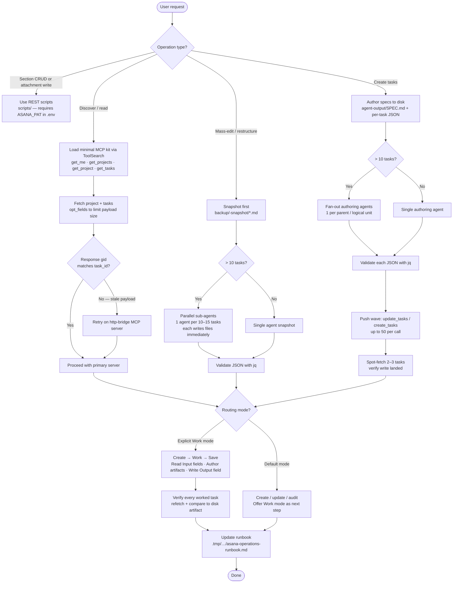

# asana
Operating playbook for driving Asana through the Asana MCP server(s). The skill treats an Asana project as a managed dataset to be discovered, mass-edited, restructured, audited, snapshotted, and deduplicated — usually in coordination with content read from a local codebase or briefing document.

It separates a **tool layer** (correct calling conventions for `get_task`, `get_tasks`, `update_tasks`, `create_tasks`, `delete_task`, and the deferred-loading dance via `ToolSearch`) from an **operation layer** (recurring patterns: discover a project, mirror prompts to custom fields, rename by pattern, restructure parents into subsections, snapshot before destructive ops, audit against an external spec). For anything spanning more than ~10 tasks the canonical move is parallel sub-agent fan-out: one agent per logical sub-unit authoring to disk, then a second wave pushing to Asana.

## Install

The fastest cross-agent install path is the `skills` CLI:

```bash
npx skills add gg-skills/asana
```

Drop this skill into a workspace as a Git submodule for pinned versions, or as a plain clone for latest `main`:

```bash
# Project-local, version-pinned:
git submodule add git@github.com:gg-skills/asana.git .claude/skills/asana

# OR project-local, latest main:
mkdir -p .claude/skills
git -C .claude/skills clone git@github.com:gg-skills/asana.git

# OR user-level, available in every project on this machine:
mkdir -p ~/.claude/skills
git -C ~/.claude/skills clone git@github.com:gg-skills/asana.git
```

Restart your agent or reload skills after installation. See the parent [`skills` catalog repo](https://github.com/gg-skills/skills) for the full catalog.

## When to use

- The user mentions an Asana project, task, subtask, custom field, or section.
- Discovering project structure, reading task content, or auditing what exists.
- Mass-editing: rename by pattern, mirror notes into a custom field, populate empty fields, add type prefixes.
- Restructuring: split a parent into A/B/C subsections, convert parents into containers, re-parent subtasks.
- Creating many subtasks at once with rich content (notes + custom fields).
- Creating tasks and then explicitly working / iterating / completing / saving outputs for them (routed Create → Work → Save mode).
- Snapshotting a project to disk before any destructive operation.
- Auditing project state against an external source-of-truth document.
- Designing meeting-recording or follow-up questions mirrored to Asana subtasks.

Skip for one-off task fetches with no editing (call the MCP directly), pure code/git work with no Asana side, or questions about Asana's web UI workflow.

## How it operates

### Inputs

**Files and folders read at runtime:**

| Path | Purpose |
|---|---|
| `.tmp/<timestamp>-<topic>/asana-operations-runbook.md` | Per-session playbook; read at session start to recover prior context |
| `.tmp/<timestamp>-<topic>/agent-output/SPEC.md` | Shared spec file consumed by parallel authoring agents |
| `.tmp/<timestamp>-<topic>/agent-output/*.json` | Per-task authored JSON validated with `jq` before push |
| `.tmp/<timestamp>-<topic>/backup/<date>-snapshot/*.md` | Per-task Markdown backups, one file per task |
| Any repo or briefing doc passed by the user | Source of truth for audit and content-authoring operations |
| `scripts/.env` (gitignored) | Auth and project GIDs for the REST scripts (see env vars below) |

**Environment variables** (read by the TypeScript REST scripts under `scripts/`):

| Variable | Required | Purpose |
|---|---|---|
| `ASANA_PAT` | Yes | Bearer credential for every REST call |
| `ASANA_DEFAULT_PROJECT_GID` | Yes* | Default `--project` when the flag is omitted |
| `ASANA_DEFAULT_WORKSPACE_GID` | Yes* | Loaded by `loadAsanaEnv()`; used by future top-level-task scripts |

*Required by `loadAsanaEnv()`. Populate via `scripts/.env` (use `scripts/.env.example` as template). MCP calls use the credentials already configured in the Claude Code MCP server — no extra env vars needed there.

### Outputs

**Files and folders written at runtime:**

| Path | Format | Written by |
|---|---|---|
| `.tmp/<timestamp>-<topic>/asana-operations-runbook.md` | Markdown | Every operation adds an entry; future sessions recover context from here |
| `.tmp/<timestamp>-<topic>/agent-output/SPEC.md` | Markdown | Authoring coordinator before fan-out |
| `.tmp/<timestamp>-<topic>/agent-output/<task-gid>.json` | JSON (validated with `jq`) | Parallel authoring agents, one file per task |
| `.tmp/<timestamp>-<topic>/backup/<date>-snapshot/<task-gid>.md` | Markdown | Snapshot agents (one agent per ~10–15 tasks) |
| `.tmp/<timestamp>-<topic>/audit-reports/<topic>.md` | Markdown | Audit operations comparing Asana state to an external spec |
| `/tmp/inventory.md` (or user-specified `--output`) | Markdown checklist | `get-project-inventory.ts` REST script |

**Median backup file size** is ~600 bytes per task when a single sequential agent is used. If files are significantly smaller than expected, re-run with parallel agents (one per ~10 tasks) — context pressure causes silent stub-writing.

### External commands

**MCP tools** (loaded on demand via `ToolSearch select:<tool>` — never bulk-loaded):

| Tool | Usage |
|---|---|
| `get_me`, `get_projects` | Discover workspace and available projects |
| `get_project(project_id=…)` | Fetch project metadata and section list (`project_id`, not `project`) |
| `get_tasks(project=…, limit=100)` | Fetch task list (`project`, not `project_id`; `limit` must be a numeric literal) |
| `get_task(task_id=…, include_subtasks=true)` | Deep fetch of a task and its subtasks |
| `update_tasks(tasks=[…])` | Batch update up to 50 tasks — names, notes, custom fields, section placement |
| `create_tasks(tasks=[…])` | Batch create tasks or subtasks with notes and custom fields |
| `delete_task(task_id=…)` | Irreversible — always snapshot first |
| `get_attachments(task_id=…)` | List attachments (MCP read-only; writes use REST) |

**Two-server failover pattern:** many setups expose both a primary Asana MCP server and an http-bridge variant. The primary can return stale/cross-wired payloads (response `data.gid` does not match `task_id`). Load both; prefer primary; retry on bridge when `response.data.gid != requested_task_id`.

**REST scripts** (under `scripts/` — Node 20.6+, `tsx`, `ASANA_PAT` from `.env`):

| Script | REST endpoint(s) | When to use |
|---|---|---|
| `create-section.ts` | `POST /projects/{gid}/sections` | Section CRUD (no MCP equivalent) |
| `list-sections.ts` | `GET /projects/{gid}/sections` | List sections as table or JSON |
| `move-tasks-to-section.ts` | `POST /tasks/{gid}/addProject` (looped) | Batch-move tasks into a section |
| `get-project-inventory.ts` | Sections → tasks → subtasks (recursive) | Discovery snapshot to Markdown |
| `set-task-dependencies.ts` | `addDependencies` per subtask | Wire Research→Visuals→Video→Deliverable DAG |
| `list-attachments.ts` | `GET /tasks/{gid}/attachments` | List attachments with `--json` for piping |
| `upload-attachment.ts` | `POST /tasks/{gid}/attachments` (multipart) | Upload local file as task attachment |
| `delete-attachment.ts` | `DELETE /attachments/{gid}` (looped) | Delete attachments by GID |

### Side effects

**Asana API mutations (irreversible or hard to reverse):**

- `update_tasks` overwrites task fields in Asana; without a prior snapshot revert is manual.
- `create_tasks` adds tasks to Asana; cleanup requires individual `delete_task` calls.
- `delete_task` is irreversible at the API layer (web UI trash retention is finite).
- `upload-attachment.ts` attaches files to tasks; remove with `delete-attachment.ts`.
- `create-section.ts` adds sections to a project; no MCP delete — use REST or web UI.

**Network:** every MCP call and REST script hits `https://app.asana.com/api/1.0/`. The REST scripts retry on HTTP 429 with `Retry-After`.

**Disk mutations:** working folder is `.tmp/<timestamp>-<topic>/`. The skill writes runbooks, specs, JSON artifacts, and backup snapshots here. Nothing is written outside this folder (and `/tmp/` for `get-project-inventory.ts --output`) unless the user specifies a different path.

### Mode toggles

| Mode | How to activate | Behavior |
|---|---|---|
| **Default (create/update/audit only)** | Implicit — active unless explicitly overridden | Creates or edits tasks, verifies, then offers Work mode as a next step |
| **Create → Work → Save** | User says "work", "iterate", "execute", "fill outputs", or "save outputs" for tasks | Continues from creation into content authoring + Asana field writes |
| **Dry-run (REST scripts)** | `--dry-run` flag on `set-task-dependencies.ts` | Prints what would change without sending any API calls |
| **Quiet (REST scripts)** | `--quiet` flag on any script | Mutes non-error log lines |
| **JSON output (REST scripts)** | `--json` flag on `list-sections.ts`, `list-attachments.ts` | Emits raw JSON suitable for `jq` piping instead of a table |
| **Skip-if-exists (upload)** | `--skip-if-exists` on `upload-attachment.ts` | Fetches existing attachments, compares name + size, skips re-upload if match found |

**Safety defaults that are always on:**

- Snapshot before destructive operations (delete, mass-rewrite).
- Verify `response.data.gid == requested_task_id` on every `get_task` call; fail over to bridge if diverged.
- Validate every authored JSON file with `jq` before the push wave.
- Author content to disk first; push in a separate second wave.
- One agent per ~10–15 tasks for backups (prevents silent stub-writing under context pressure).

## Operational flow



## Layout

```
.
├── SKILL.md                          - entry point: routing modes, non-negotiable policy, quick commands, workflow
├── agents/
│   └── openai.yaml                   - OpenAI agent surface metadata
├── assets/                           - skill icons (large/small/master) + icon-generation prompts
├── references/
│   ├── quick-reference.md            - most common commands in one place
│   ├── tools-cheatsheet.md           - exhaustive MCP tool surface with parameter shapes and gotchas
│   ├── operations-catalog.md         - patterns of work: discover, mass-edit, restructure, snapshot, audit, dedup
│   └── parallel-agent-patterns.md    - sub-agent fan-out, shared specs, two-wave authoring/pushing
└── scripts/                          - TypeScript REST wrappers for surfaces the MCP server does not expose
    ├── README.md                     - full script catalog
    ├── package.json                  - declares tsx + Asana REST deps
    ├── tsconfig.json
    ├── _lib/                         - shared REST helpers (auth, fetch, types)
    ├── create-section.ts             - REST: create a section in the default project
    ├── list-sections.ts              - REST: list sections (table or --json)
    ├── move-tasks-to-section.ts      - REST: move N tasks into a section
    ├── get-project-inventory.ts      - REST: snapshot the section/task/subtask tree to markdown
    ├── set-task-dependencies.ts      - REST: wire Research→Visuals→Video→Deliverable DAG
    ├── list-attachments.ts           - REST: list attachments on a task
    ├── upload-attachment.ts          - REST: upload a local file as a task attachment
    └── delete-attachment.ts          - REST: delete attachments by GID
```

The `scripts/` directory is its own small Node project (own `package.json` / `package-lock.json` / `tsconfig.json`); run `npm install` inside it once, then invoke the wrappers via `npx tsx --env-file=../.env <script>.ts`.

## Quick start

[SKILL.md](SKILL.md) is the entry point — it covers the routing modes (default Create/Update/Audit vs. explicit Create → Work → Save), the non-negotiable policy (snapshot before destructive ops, verify returned `gid` matches requested `task_id`, parallelize per logical unit, author to disk first), the quick command catalog, and the troubleshooting matrix.

For the REST fallback scripts that cover MCP gaps (section CRUD, attachment upload/delete):

```bash
cd scripts && npm install
npx tsx --env-file=../.env list-sections.ts
```

See [scripts/README.md](scripts/README.md) for the full per-script reference.

## Resources

- [SKILL.md](SKILL.md) — operating playbook, routing modes, policy, troubleshooting
- [agents/openai.yaml](agents/openai.yaml) — agent surface metadata
- [references/quick-reference.md](references/quick-reference.md) — common commands in one place
- [references/tools-cheatsheet.md](references/tools-cheatsheet.md) — MCP tool surface + gotchas
- [references/operations-catalog.md](references/operations-catalog.md) — patterns of work
- [references/parallel-agent-patterns.md](references/parallel-agent-patterns.md) — sub-agent fan-out
- [scripts/](scripts/) — REST fallback wrappers for missing MCP coverage
- [assets/](assets/) — skill icons

## Caveats

- **Asana MCP tools are deferred.** Schemas must be loaded via `ToolSearch select:<tool-name>` before they can be called. Load only the kit the current operation needs — bulk loading is wasteful.
- **Two-server failover.** Many setups expose both a primary and an http-bridge Asana MCP server. The primary has a known stale/cross-wired response bug; always verify `response.data.gid == requested_task_id`, and fall back to the bridge when it diverges.
- **Param-name inconsistency.** `get_project` uses `project_id`; `get_tasks` uses `project`. Mixing them returns `Not a Long: undefined`. `limit` must be a numeric literal, never a string.
- **Snapshot before destruction.** `delete_task` is irreversible at the API layer and web-UI trash retention is finite. Always run the backup pattern first and keep the deletion list as a revert manifest.
- **Parallelize backups too.** A single agent backing up 100+ tasks shortcuts under context pressure and writes stubs (~600 bytes per file is the tell). One agent per ~10-15 tasks, with each file committed immediately.
- **Section CRUD and attachment writes are REST-only** — the primary MCP server has no `create_section` / `update_section` / `delete_section` / `list_sections`, and no upload or delete tool for attachments. Use the `scripts/` wrappers.
- **Do not auto-work created tasks** unless the user explicitly asks. Creating tasks/subtasks normally stops after creation + verification; offer Create → Work → Save mode as a next step rather than starting it.
